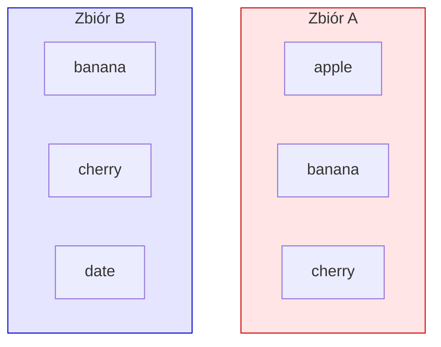
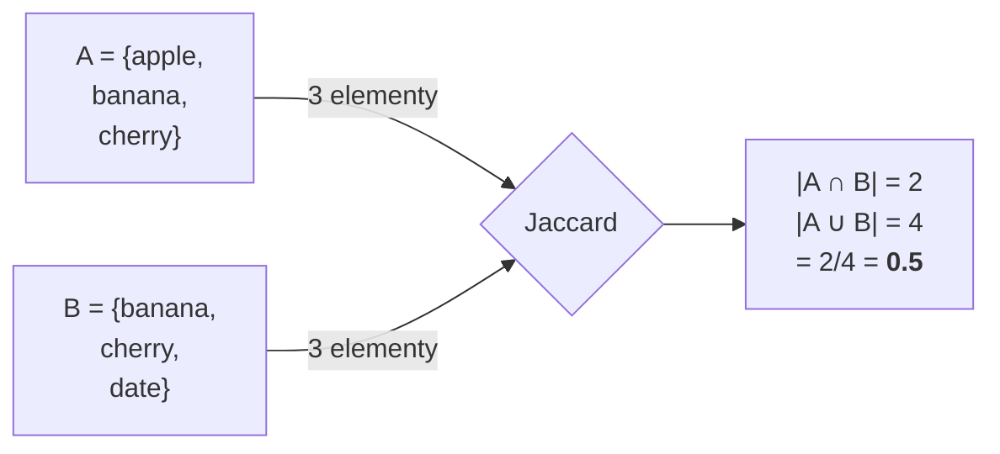
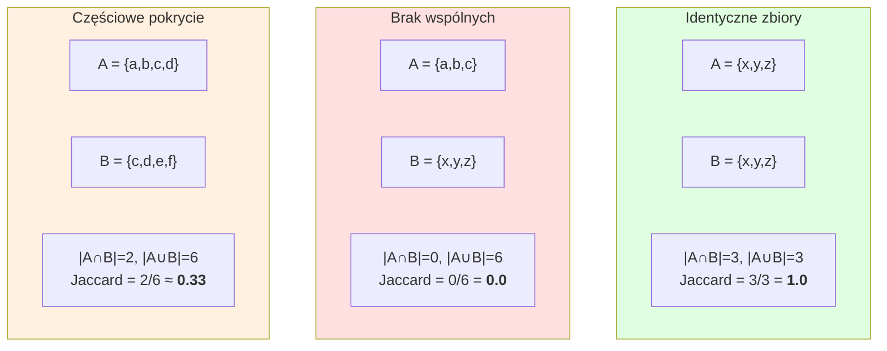
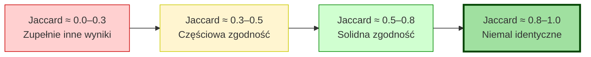

# Jaccard — co to jest i jak działa

## TL;DR

**Jaccard Index** to miara podobieństwa dwóch zbiorów. Zwraca liczbę od 0 do 1:

- **0** = zbiory zupełnie różne (zero wspólnych elementów)
- **1** = zbiory identyczne
- **0.5** = mniej więcej połowa elementów jest wspólna

Wzór:

```
                |A ∩ B|        liczba elementów wspólnych
Jaccard(A, B) = ─────────  =  ─────────────────────────────
                |A ∪ B|        liczba wszystkich unikalnych elementów
```

`∩` = część wspólna (intersection), `∪` = suma (union).

## Wizualnie



- A ∩ B = `{banana, cherry}` → 2 elementy
- A ∪ B = `{apple, banana, cherry, date}` → 4 elementy
- **Jaccard = 2/4 = 0.5**



## Skrajne przypadki



## Dlaczego nie tylko „liczba wspólnych"?

Bo bez normalizacji nie można porównywać zbiorów różnej wielkości.

| Przypadek | A∩B | Naive overlap count | Jaccard |
|---|---|---|---|
| A=10 elem, B=10 elem, wspólne=5 | 5 | 5 | 5/15 = 0.33 |
| A=100 elem, B=100 elem, wspólne=5 | 5 | 5 | 5/195 ≈ 0.026 |

Ten sam „liczba wspólnych = 5", ale w drugim przypadku to *prawie nic* (5 z 195 unikalnych). Jaccard normalizuje przez wielkość.

## Co to NIE jest

- **NIE jest** miarą odległości (chociaż `1 - Jaccard` daje "Jaccard distance").
- **NIE uwzględnia kolejności** elementów (zbiory nie mają kolejności).
- **NIE uwzględnia wag** (każdy element waży tyle samo). Dla wag → użyj `Weighted Jaccard`.
- **NIE jest dobry dla bardzo małych zbiorów** — `Jaccard({x}, {})` = 0/1 = 0, ale `Jaccard({x,y}, {y})` = 1/2 = 0.5. Pojedyncza zmiana znacznie waha wynik.

## Jak my go używamy w tym projekcie

W `final_results/<run>/entity_layer.jsonl` mamy listy encji per artykuł:

```json
{
  "url_hash": "abc123",
  "entities": [
    {"name": "kurczak", "type": "Product"},
    {"name": "marchewka", "type": "Product"},
    {"name": "90°C", "type": "Temperature"}
  ]
}
```

Dla danego URL z dwóch różnych runów (np. baseline two-step vs three-step v2) bierzemy **zbiór par `(name.lower(), type)`** i liczymy Jaccard:

```python
def entity_jaccard(record_a, record_b):
    A = {(e["name"].lower(), e["type"]) for e in record_a["entities"]}
    B = {(e["name"].lower(), e["type"]) for e in record_b["entities"]}
    return len(A & B) / len(A | B)
```

Przykład realny (z compare_onestep dashboard):

```
URL: artykuł kulinarny "rosół"

Baseline run encje:
  ("rosół", "Product")
  ("kurczak", "Product")
  ("marchewka", "Product")
  ("90°C", "Temperature")
  ("2 godziny", "Duration")

v2 b2 run encje:
  ("rosół", "Product")
  ("kurczak", "Product")
  ("marchewka", "Product")
  ("seler", "Product")          ← nowa
  ("90°C", "Temperature")
  ("2 h", "Duration")           ← inna forma → inna nazwa

A ∩ B = {("rosół","Product"), ("kurczak","Product"),
         ("marchewka","Product"), ("90°C","Temperature")}    → 4
A ∪ B = wszystkie unikalne pary z obu list                   → 7

Jaccard = 4/7 ≈ 0.57
```

## Interpretacja wyników w pipeline



W naszych pomiarach:

| Run | Jaccard mean vs baseline two-step | Interpretacja |
|---|---|---|
| one-step (compare_onestep__baseline5000) | 0.472 | częściowa zgodność — różny prompt context |
| three-step v1 (`p1_500`) | 0.552 | nieco lepiej, ale wciąż średnio |
| three-step v2 b2 | 0.495 | porównywalnie z one-step |

**Próg D7c "≥0.95" jest BARDZO surowy** — oznacza że nowy pipeline ma produkować **prawie identyczne** encje co baseline. Sensowny próg dla "no quality regression". Wartości 0.4-0.6 oznaczają, że dwa pipeline'y wybierają inne encje, nawet jeśli pojedynczo każde są poprawne — różny prompt = różna interpretacja semantyki.

## Warianty i krewni

- **Jaccard distance** = `1 - Jaccard`. Im większy, tym dalej. Używana w klastrowaniu.
- **Sørensen-Dice coefficient** = `2|A∩B| / (|A|+|B|)`. Zwykle daje wyższe wartości niż Jaccard, ale zachowuje porządek (jeśli J(A,B) > J(C,D), to też Dice(A,B) > Dice(C,D)).
- **Tanimoto coefficient** — dokładnie to samo co Jaccard, używane w cheminformatyce dla fingerprintów molekularnych.
- **Overlap coefficient** = `|A∩B| / min(|A|,|B|)`. Mówi „ile mniejszego zbioru zawiera większy". Np. dla A={a,b}, B={a,b,c,d,e,f,g} → overlap=1.0, ale Jaccard=2/7≈0.29. Inna pytanie, inna odpowiedź.

## Implementacja w Pythonie

```python
def jaccard(a: set, b: set) -> float:
    """Returns Jaccard index between two sets. Returns 1.0 if both empty."""
    if not a and not b:
        return 1.0  # konwencja: dwa puste zbiory = identyczne
    return len(a & b) / len(a | b)
```

Ze stdlib (`set`), bez bibliotek. Złożoność O(|A| + |B|).

## Kiedy używać Jaccarda

✅ **Dobry wybór** dla:
- porównywania list rzeczy bez kolejności (encje, tagi, klucze)
- gdy każdy element waży tyle samo
- gdy zbiory mają porównywalną wielkość

❌ **Zły wybór** dla:
- ciągów znaków/tekstu (użyj edit distance / cosine similarity na embeddingach)
- danych z kolejnością (sekwencje DNA, time series)
- gdy elementy mają wagi (użyj weighted Jaccard)
- gdy jeden zbiór jest dużo większy od drugiego (overlap coefficient lepszy)

## Resources

- Wikipedia: <https://en.wikipedia.org/wiki/Jaccard_index>
- W tym repo: użycie w `dashboard/views/compare_onestep.py` (porównanie one-step vs two-step) i w analizie three-step (`SESSIONS_SUMMARY.md`).
