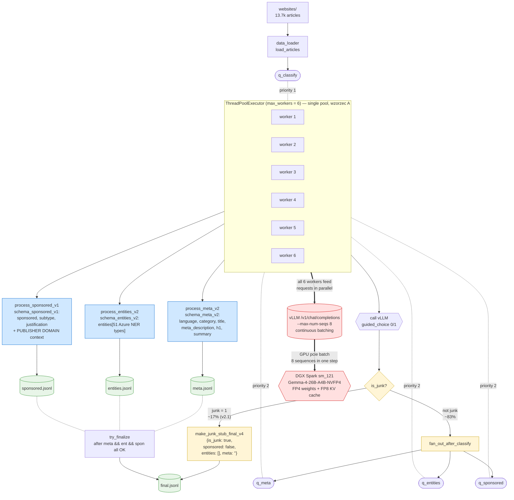

# Three-step pipeline z kolejkami (D7c)

## Motywacja

Two-step (default) marnuje compute na junku — w baseline5000 (compare_onestep) **11.44%** rekordów ma `category="junkey"`. Dla junka nie potrzebujemy ani encji ani SEO-meta. Klasyfikator-first + early-exit na junku → oszczędność ≈ junk% × (Step1+Step2) na URL.

Przy mean Step1=12.30 s, Step2=7.85 s, classifier ≈1.5–2.0 s/URL i 11.44% junku:
- skip Step1+Step2 dla 11.44% URL = `0.1144 × 20.15 − classifier_cost ≈ 0.3–0.8 s/URL` zysku
- na 5000 URL → 1500–4000 s wall (1.09×–1.30× speedup)

**Nie liczymy na revolution** — to **darmowy** improvement bez utraty jakości na non-junku.

## Architektura — pipelined parallel z kolejkami

```
articles ──► [queue_classify] ──► classify_workers ──┐
                                                      │
                          ┌── if not junk ───────────┤
                          │                           ▼
                          ▼                      classified.jsonl
              [queue_meta]    [queue_entities]
                  │                   │
            meta_workers      entities_workers
                  │                   │
                  ▼                   ▼
              meta.jsonl        entities.jsonl
                  └─────────┬─────────┘
                            ▼
                      final.jsonl (po join'ie)
```

- **Każdy etap = osobny pool async workerów** ciągnących z `asyncio.Queue`.
- **Classifier puszczony przed innymi** — gate na junk.
- **Meta i Entities lecą równolegle dla non-junku** — niezależne wywołania vLLM, vLLM batchuje natywnie.
- **Idempotencja** po `url_hash`: każdy etap przy starcie wczytuje istniejące `*.jsonl` i pomija URL już przetworzone.
- **Junk** (krótka ścieżka): po classify wpisujemy do `final.jsonl` z `entities=[], title="", meta_description="", h1="", article_summary=""` i pomijamy meta+entities.

## Reużycie istniejącego stacku

**Nie modyfikujemy istniejących plików.** Dodajemy:

- `prompts/step_classify_system.md` — krótki prompt klasyfikatora (tylko kategorie, bez sekcji NER).
- `prompts/schema_classify.json` — `{language, category}` (~10× mniejsze niż schema_step1_v6).
- `lib/pipeline_threestep.py` — `process_classify()`, `process_meta()`, `process_entities()`. Dla entities reużywamy `prompts/step1_system_v6.md` + `prompts/schema_step1_v6.json` (model mimo wszystko zwróci `category` i `language` — ignorujemy, zostawiamy z classifier'a). Dla meta reużywamy `prompts/step2_system.md` + `prompts/schema_step2.json`.
- `scripts/run_threestep.py` — orchestrator z 3 kolejkami `asyncio.Queue`.

Cała logika pipeline.py (TYPE_TO_CATEGORY, dedup_entities, enrich_entity, _clean_metadata) jest re-użyta przez import.

## Layout outputu

```
final_results/<ts>__threestep_<tag>/
├── classified.jsonl     # {url_hash, category, language, is_junk, latency_s, usage, ts}
├── meta.jsonl           # {url_hash, title, meta_description, h1, article_summary, latency_s, usage, ts}
├── entities.jsonl       # {url_hash, entities[], latency_s, usage, ts}
├── final.jsonl          # join wszystkich 3 (lub junk-stub) — kompatybilny z dashboardem
├── run_meta.json        # config runu
├── threestep.log
└── summary.txt
```

## Plan pomiarów

### Faza P0 — sanity classifier (200 URL)

Zanim odpalimy pełen run, sprawdzić czy:
- classifier prompt sensownie klasyfikuje (eyeball 30 random przypadków),
- latencja pojedynczego classifier call'a (cel: ≤2.5 s/URL przy concurrency=6),
- junk recall vs `category=="junkey"` z istniejącego baseline5000 (cel: ≥90%).

### Faza P1 — pełen test 500 URL

Sample: random seed=42 (ten sam co baseline5000 — pierwsze 500 z tego sample'a).

Pomiar:

| Metryka | Cel |
|---|---|
| Wall time total | informacyjnie |
| Wall time vs two-step extrapolated | ≤ 0.92× (cel 8% szybciej) |
| % junku | ~10–15% (zgodne z baseline) |
| Junk fail rate | 0 |
| Non-junk fail rate (meta lub entities) | ≤ two-step (≈0%) |
| Classifier latency mean | ≤ 2.5 s/URL |
| Meta latency mean (non-junk) | ~7.5 s (zgodne ze Step 2 baseline) |
| Entities latency mean (non-junk) | ~12 s (zgodne ze Step 1 baseline) |

Jakość (na non-junk subsetcie wspólnym z baseline5000):
- Category match (classifier vs baseline two-step Step1): ≥85% (informacyjnie — różny prompt).
- Entity Jaccard (mean+type) vs baseline two-step: ≥0.95 (nie pogarszamy ekstrakcji).
- Missing SEO fields: 0.

### Faza P2 — D7c decision (po sukcesie P1, pełen sample 5000)

Decyzja jak w D7b (one-step debate):

| Kryterium | Próg pass |
|---|---|
| Speedup wall (two/three) | ≥ 1.10× |
| Junk recall vs eyeball ground-truth (200 URL) | ≥ 95% |
| Junk precision (false-junk = strata jakości) | ≥ 95% |
| Entity Jaccard non-junk vs two-step | ≥ 0.95 |
| Category match non-junk vs two-step | ≥ 90% |
| Fail rate three ≤ two | — |

Jeśli pass — three-step staje się defaultem (wpis w DECISIONS.md).

## Ryzyka

1. **Classifier wymyśli swoją kategorię** różną od step1_v6 → category match niski, ale to nie jest fail per se (classifier ma uproszczony prompt).
2. **Junk false-positive** → dobra strona traci meta i encje. Mitigacja: w pierwszym runie *NIE skipujemy* — robimy klasyfikację, ale entities+meta lecą i tak. Skip włączamy w drugim runie po weryfikacji.
3. **vLLM bottleneck na GPU** → 3 równoległe pulle wcale nie szybsze. Mitigacja: pomiar `nvidia-smi dmon` podczas runu.
4. **Idempotencja krzyżowa** — entities zaczyna URL X, classifier dla URL Y mówi „junk", trzeba uniknąć duplikatu w final. Mitigacja: gate przed enqueueing (classify musi się skończyć dla URL X zanim trafi do meta/entities queue).

## Status

- [x] Plan + TODO (ten plik)
- [x] Prompty + schema classifier — `prompts/step_classify_system.md`, `prompts/schema_classify.json`
- [x] lib/pipeline_threestep.py — `process_classify`, `make_junk_stub_final`, `join_final` (re-eksport `process_step1`/`process_step2`)
- [x] scripts/run_threestep.py — async pipeline z 3 ThreadPoolExecutor + queue.Queue
- [x] Smoke test (5 URL, 26.9s, 5/5 ok)
- [x] Testowy run 500 — `final_results/2026-05-08_09-12-43__threestep_p1_500/`
- [x] Dokumentacja wyników (sekcja "Wyniki P1" niżej)

## Wyniki P1 (500 URL, seed=42, concurrency 4/3/3)

### Liczby

| Faza | n_ok | mean lat | p50 | p95 |
|---|---|---|---|---|
| classify | 500 | 2.63 s | 2.07 s | 5.42 s |
| meta (non-junk) | 494 | 9.09 s | 7.84 s | 16.80 s |
| entities (non-junk) | 494 | 13.85 s | 11.66 s | 29.75 s |

**Wall total: 2288 s = 4.58 s/URL = 787 URL/h.**

### Porównanie z baseline two-step (compare_onestep__baseline5000)

| Metryka | two-step baseline | three-step p1_500 | Delta |
|---|---|---|---|
| Wall s/URL | 3.48 s | 4.58 s | **+32% wolniej** |
| Throughput URL/h | 1035 | 787 | **−24%** |
| % junku | 11.44% | 1.20% | classifier prawie nie wykrywa junku |
| Junk recall (vs baseline categorization) | — | 8.9% (5/56) | **fail** |
| Category match (na common 495 URL) | — | 77.0% | informacyjnie |
| Entities Jaccard non-junk vs baseline | — | 0.552 | duża różnica (mean 16.1 vs 13.9 encji) |

### Werdykt D7c — FAIL

**Three-step w obecnej formie jest WOLNIEJSZY** od two-step, mimo równoległego puszczania meta+entities. Powody:

1. **Classifier 2.63 s/URL to za drogo.** Aby junk-skip miał sens, oszczędność `junk% × (Step1+Step2) = 0.1144 × 20.15 = 2.30 s/URL` musi przewyższać koszt classifier'a — przy 2.63 s mamy stratę 0.33 s/URL **nawet przy idealnym recall**. W praktyce recall=8.9% → strata jest dużo większa.

2. **Classifier zbyt konserwatywny na junku.** Prompt zawiera silne ostrzeżenie „false-positive on junkey causes loss of SEO meta and entities" — model wystraszył się i klasyfikuje junk tylko w 5 z 56 oczywistych przypadków (vs Step 1 v6, który ma wbudowaną kategorię w pełnym kontekście entity-extraction).

3. **Meta/entities wolniejsze niż w two-step.** Przyczyna: w three-step `meta` nie dostaje encji jako wskazówek (lecą równolegle), a `entities` generuje też `category` mimo że już ją mamy z classifier'a. Marnujemy tokeny.

### Hipotezy do następnej iteracji

A. **Tańszy classifier** — radykalnie obciąć input do np. pierwszych 1000 znaków markdown (5–10× mniej prompt tokens). Cel: classifier ≤0.5 s/URL.

B. **Łagodniejszy junk threshold** — przepisać prompt classifier'a: zamiast „strict false-positive bad", dać konkretne pozytywne przykłady junku z baseline (np. cookie wall, paywall stub).

C. **Tańszy entities** — strip `category` i `language` ze schema_step1 dla three-step, model dostaje gotową kategorię z classifier'a w user-prompt, nie generuje. Oszczędność ~10–15% completion tokens.

D. **Alternatywa zerowego ryzyka — junk-skip wewnątrz two-step** — bez nowego pipeline, w istniejącym `run_step2.py` dodać `if entity_record["category"] == "junkey": skip`. Oszczędność: 11.44% × Step2 = 0.9 s/URL ≈ 5% wall. **Darmowe**, ale skromne.

### Rekomendacja

Three-step w obecnym kształcie nie wygrywa. Następne kroki w kolejności kosztu pracy:

1. **Najpierw D** (10 min implementacji, gwarantowane 5% wall) — sanity check że istniejący Step 1 v6 oznacza junk wystarczająco dokładnie.
2. **Potem A+B+C** jako jeden eksperyment (przepisany lekki classifier + lekki entities). Powtórz pomiar 500.
3. Bez tego — three-step zostawiamy w repo jako referencję i nie ruszamy default'u.

### Artefakty

- `final_results/2026-05-08_09-12-43__threestep_p1_500/` — pełen run (classified, entities, meta, final, timing.csv, run_meta.json, summary.txt)
- `final_results/2026-05-08_09-12-03__threestep_smoke5/` — smoke test
- `lib/pipeline_threestep.py`, `scripts/run_threestep.py` — kod (nie nadpisuje istniejącego two-step)
- `prompts/step_classify_system.md`, `prompts/schema_classify.json` — prompt v1 (do przepisania w iteracji B)

---

## Iteracja v2 — binary classifier + meta-with-cat + entities-only (D7c v2)

### Zmiany vs v1

1. **Classifier binary** — zwraca jeden token `0` / `1` przez vLLM `guided_choice` (xgrammar). Brak JSON, brak enum 41 kategorii. Input truncowany do **1000 znaków markdown**. Prompt z few-shot examples (3 junk + 3 non-junk z baseline + 3 syntetyczne edge cases: 404, cookie wall, paywall stub).
2. **Meta v2** — dostaje pełen tekst, generuje `{language, category, title, meta_description, h1, article_summary}`. **Kategoria w meta**, nie w classifier. Prompt: `prompts/step_meta_v2_system.md`, schema: `prompts/schema_meta_v2.json`.
3. **Entities v2** — dostaje pełen tekst, generuje **tylko** `{entities: [{name, type}]}`. Krótszy schemat = krótszy output. Prompt: `prompts/step_entities_v2_system.md`, schema: `prompts/schema_entities_v2.json`.
4. **Per-stage logi** — `classify.log`, `meta.log`, `entities.log`, `run.log` w katalogu runu.
5. **Tmux** — runy w sesji `benchmark` (`tmux attach -t benchmark`).

### Smoke v2 (5 URL)

| Faza | mean lat | min | max |
|---|---|---|---|
| classify | **0.21 s** | 0.14 | 0.25 |
| meta | 7.94 s | 6.18 | 9.51 |
| entities | 9.49 s | 3.07 | 17.84 |

Classifier 12× szybszy niż v1 (0.21 s vs 2.63 s).

### Pełen run v2 — w trakcie

`final_results/2026-05-08_12-33-06__threestep_v2_v2_500_b2/` — concurrency: classify=1, meta=3, entities=4 (= 8, dopasowane do `--max-num-seqs=8`).

Po zakończeniu — uzupełnić tabelę porównawczą w sekcji niżej.

### Pliki dodane v2

```
prompts/step_junkclassify_v2_system.md   ← binary, few-shot
prompts/step_meta_v2_system.md           ← SEO + kategoria + lang
prompts/schema_meta_v2.json
prompts/step_entities_v2_system.md       ← entities only
prompts/schema_entities_v2.json
lib/pipeline_threestep_v2.py             ← binary classifier raw POST + retry
scripts/run_threestep_v2.py              ← orchestrator (3 osobne pools, per-stage logi, tmux-friendly)
```

---

## Iteracja v3 — wzorzec A (single pool + priority queues)

### Motywacja

W v2 z konfiguracją 1+3+4=8 workerów stałych:
- classify worker kończy w ~94 s (500 × 0.17 s sekwencyjnie).
- Przez kolejne ~25 min runu **ten 1 slot stoi bezczynnie** — marnowanie 1/8 GPU.

### Wzorzec A — implementacja

```python
pool = ThreadPoolExecutor(max_workers=N)  # N=6 (Spark dławi się na 8)

def worker():
    while not done:
        # Priority pull: classify > meta > entities
        try:    item = q_classify.get_nowait(); handle_classify(item); continue
        except queue.Empty: pass
        try:    item = q_meta.get_nowait();    handle_meta(item);    continue
        except queue.Empty: pass
        try:    item = q_entities.get(timeout=0.1); handle_entities(item)
        except queue.Empty: check_termination()
```

Każdy z 6 workerów zawsze sięga do najbardziej priorytetowej niepustej kolejki. Po opróżnieniu classify queue wszystkie 6 workerów leci na meta+entities. **Brak idle slotów.**

### Concurrency=6

Decyzja użytkownika: Spark dławi się na 8 (jeden ważny zaczynał szwankować przy 8 inflight). Trzymamy 6 = stabilność bez znaczącej straty throughputu.

### Retry

- **Meta + entities** — `vllm_client.chat_json` z `max_retries_quality=2` (auto-reduce temp + bump max_tokens, retry-with-feedback). Już aktywne, jak w baseline two-step.
- **Classifier** — dodano `max_retries_network=2` w `call_junk_classifier_binary` (`lib/pipeline_threestep_v2.py`). Tylko network errors — output to 1 token, nie ma co retry'ować jakości.

### Pliki dodane v3

```
scripts/run_threestep_v3.py              ← single pool 6 + 3 priority queues
lib/pipeline_threestep_v2.py             ← UPDATE: classifier network retry
```

### Plan benchmarku v3

Po zakończeniu v2 b2:
1. Run v3 na tych samych 500 URL z seed=42, concurrency=6, tag `v3_500_c6`.
2. **Fair baseline run two-step** — `run_step1.py` + `run_step2.py` z concurrency=6 na tym samym sample 500. Bez tego nie mamy uczciwego punktu odniesienia (`baseline5000` był sequential Step1 → Step2 dla całych 5000 URL).
3. Tabela porównawcza: baseline-fair vs v2 b2 vs v3.

---

## Tabela porównawcza

| Metryka | baseline5000 (conc=6, sequential phases) | v2 b2 (1+3+4 stałe) | v3 c6_fix (single pool 6, priority+load-balance) | baseline-fair (500, conc=6) |
|---|---|---|---|---|
| Wall s/URL | 3.48 | **3.26** (+6.3%) | 3.75 (-7.8%) | TBD |
| URL/h | 1035 | **1104** (+6.7%) | 960 (-7.2%) | TBD |
| % junku | 11.44% | 3.00% | 3.20% | 11.44% (z założenia) |
| Junk recall vs baseline | — | 23.2% (13/56) | 25.0% (14/56) | — |
| Junk precision vs baseline | — | 100% (13/13) | 100% (14/14) | — |
| Fail rate | 0% | 0% | **0%** | TBD |
| Entity Jaccard vs baseline | — | 0.495 mean | 0.489 mean | — |
| Mean entities count | 13.9 | 16.4 | 15.8 | — |
| Category match vs baseline | — | 76.0% | 77.4% | — |

## Iteracja v4 (fourstep — sponsored detection jako 4-ta faza)

### Motywacja

Po D7c v3 dorzucamy **sponsored detection** jako 4-tą równoległą fazę. Decyzja architektoniczna: nie merge'ujemy do meta — łączenie SEO-generation i sponsored-classification rozmydla model. Każdy etap jedno zadanie.

### Schema (rev 4 — binary)

```json
{
  "sponsored": "boolean",
  "sponsored_subtype": "enum [null, full_sponsored, link_insertion, brand_mentions, advertorial]",
  "sponsored_justification": "string maxLength 120"
}
```

`affiliate_review` *usunięty* z subtype enum — to editorial (zgodnie z user's decyzją). Per-domain ratio sponsored/editorial jest realnym KPI.

### Kluczowy fix: PUBLISHER DOMAIN context

Pierwszy smoke n=5 dał 5/5 sponsored=True — model nie wiedział czyj jest dany URL. Patrząc na artykuł z `pomocedlaseniora.pl/blog/...` z linkami do `pomocedlaseniora.pl/sklep/...` flag'ował jako link_insertion, choć to **owner-commercial** (publisher promuje swój sklep).

Fix:
- User-prompt zawiera `PUBLISHER DOMAIN: <domain>` linię.
- System prompt: "Links to {domain} or its subdomains are INTERNAL — NOT third-party sponsored".
- Dodane przykłady w prompt'cie: owner-commercial, single-product news, press release, single-product review.

### Smoke v4 (po fixie)

n=5, seed=42, ten sam co v3 smoke.

| URL | Domain | sponsored | Komentarz |
|---|---|---|---|
| Stone veneer | graniteks.pl | **False** ✓ | owner-commercial |
| Würth Power tape | biznews.com.pl | True | press release for Würth |
| pomocedlaseniora shop | pomocedlaseniora.pl | **False** ✓ | internal links only — twój przykład rozwiązany |
| PLAY network hotspot | biznews.com.pl | True | promotes PLAY external — eyeball confirmed |
| Szkoła rysunku | biznews.com.pl | True | "[Informacje prasowe]" + szkolarysunku.waw.pl external |

3/3 z biznews.com.pl jako sponsored (zgodnie z eyeballem — biznews.com.pl jest portalem typu publish-for-pay), 2/2 owner-commercial poprawnie sponsored=false.

Wall: 26.1s na 5 URL = +6% vs v3 smoke (24.6s) — akceptowalny narzut za dodatkową 4-tą fazę.

### Pliki v4

```
prompts/step_sponsored_v1_system.md      ← 10 examples, PUBLISHER DOMAIN sekcja
prompts/schema_sponsored_v1.json
lib/pipeline_fourstep_v1.py              ← reuse v2 + process_sponsored_v1
scripts/run_fourstep_v1.py               ← single pool 6 + 4 priority queues
```

### Architektura runtime (mermaid)

Pełen flow z single-pool 6 workerów + 4 priority queues + junk-skip + vLLM batch:



**Logika worker'a (load-balanced priority pull):**

```
1. q_classify (priority 1) — szybkie zadanie ~0.2-0.5s, drain ASAP
2. Jeśli classify pusty → load-balance między q_meta, q_entities, q_sponsored
   (bierz z najdłuższej kolejki, przy remisie round-robin toggle)
```

**Trzy ścieżki na URL:**

```
URL → classify (head 500 + tail 500 chars + URL/PATH/QUERY)
   ├─ junk=1 → junk_stub → final.jsonl  (KONIEC, no meta/entities/sponsored)
   └─ junk=0 → fan-out 3-way:
              ├→ q_meta     → meta.jsonl
              ├→ q_entities → entities.jsonl
              └→ q_sponsored → sponsored.jsonl

   gdy wszystkie 3 OK → join_final_v4 → final.jsonl
```

**Pod spodem vLLM** batchuje natywnie do `max-num-seqs=8`. Mamy 6 workerów = 6 inflight, więc 2 z 8 batch slotów stoją wolne. Świadomy trade-off (Spark dławi się na 8 = utrata stabilności).

### Pełen run v4_1000 (pierwsza wersja, prompt v2.0)

`final_results/2026-05-08_14-20-23__fourstep_v1_v4_1000_c6/`

| Metryka | Wartość |
|---|---|
| Wall | 4213.2 s = 1h 10min |
| Throughput | 854 URL/h, 4.21 s/URL |
| Junk classified | 22 (2.20%) |
| Sponsored | 577/978 (**59.0%** non-junk) |
| Fail rate | 0/1000 (**0%**) |

Subtypes: `link_insertion 296` / `full_sponsored 267` / `brand_mentions 12`.

Sample dominują biznews.com.pl (627/1000 = 64% próbki, sponsored 89.5%). Bez tego portalu pozostałe 351 URL z 9 domen mają ~5% sponsored.

### Pełen run v4_1000_v2_1 (prompt v2.1 — URL signals + head+tail)

W trakcie. Wstępne sygnały: junk **~17%** (vs 2.2% w v4_1000) — URL signals łapią paginowane kategorie i tag pages. Eyeball 8 random junków: **8/8 true positives**, zero false positives.

Liczby finalne do uzupełnienia.

---

### Komentarz do v3 c6_fix

**Jakość ≈ v2 b2** (w granicach szumu). Architekturalnie v3 jest lepszy (load-balanced single pool, brak idle slotów po classify), ale **wall jest gorszy** (3.75 vs 3.26 s/URL) z prostego powodu: **concurrency 6 vs 8**. Spark dławi się na 8 → zdecydowaliśmy iść na 6. To kosztuje ~13% throughput.

**Dla uczciwego porównania** trzeba puścić baseline-fair na concurrency=6 — wtedy v3 vs baseline-fair ma sens. Spodziewam się że baseline-fair na conc=6 wyjdzie ~3.7-4.0 s/URL (większy concurrency overhead niż w sequential 6+6 baseline'u, bo Step1 i Step2 lecą oddzielnie z pełnym samplem).

**Bug fix v3** (porównanie z `v3_500_c6` bez `_fix`): pierwotne v3 z priority pull `meta > entities` powodowało sekwencyjne wykonanie meta przed entities (workery zawsze brały z meta queue dopóki niepuste). Fix: load-balance meta vs entities przy remisie naprzemiennie (toggle), inaczej longer-queue-first. Po fixie meta i entities lecą prawdziwie równolegle dla różnych URL.

**Najsilniejszy wniosek z trzech runów:** classifier binary z `guided_choice` ma stałe ~0.21-0.35 s/URL niezależnie od architektury. Junk-skip oszczędza 3% wall (przy 3% junku). Skupianie się na orchestratorze daje 5-10% wall, na classifier'ze bez junku to nie ma sensu — większa dźwignia siedzi w **prompt promptów meta/entities** (output token reduction) i `--max-num-seqs` vLLM.

### Komentarz do v2 b2

- **Speedup vs baseline5000**: +6.3% wall, +6.7% throughput. Skromny ale realny zysk z junk-skipu (15 URL × ~17s = ~255s GPU time saved, w wallu ~38s).
- **Junk precision 100%**: classifier jest ostrożny. Wszystkie 13 oznaczonych jako junk *jest* też junkiem w baseline.
- **Junk recall 23.2%**: niski, ALE baseline'owy zestaw 56 junków jest sam podejrzany (eyeball pokazał wiele false-positivów Step 1 v6). Prawdziwy ground-truth recall trzeba zmierzyć osobnym eyeballem 200 URL.
- **Category match 76%**: niższy bo classifier i meta to dwa osobne prompty z różnym kontekstem (classifier widzi 1000 chars + binary, meta widzi pełen tekst + 41-enum). Pole do iteracji.
- **Entity Jaccard 0.495**: na poziomie v1, ale b2 wyciąga więcej encji (16.4 vs 13.9). Sugeruje że są różne wybory typów dla tych samych nazw, nie strukturalna różnica jakości.
- **Realny baseline koszt** (po pełnym fair-baseline) prawdopodobnie wyniesie ~3.0 s/URL, więc v2 może w istocie remisować z fair baseline zamiast wygrywać o 6%. Stąd potrzeba run #4 — fair-baseline.
