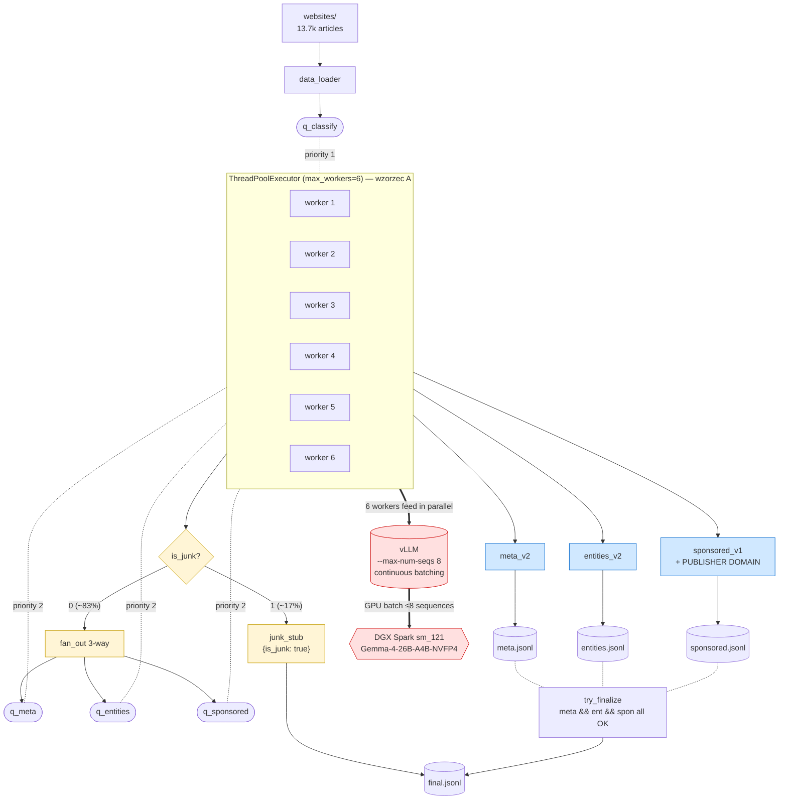

# Two-step vLLM pipeline — ekstrakcja meta SEO + encji

Pipeline ekstrakcji metadanych z artykułów HTML, model **Gemma 4 26B A4B NVFP4** + vLLM + xgrammar (`response_format: json_schema`). Cel: 21M URL na różnych domenach.

**Status:** Phase 0–4 ✅ ukończone. Phase 5 (E2E na 155 URL) gotowe do uruchomienia.

**Schema encji:** Microsoft Azure NER (51 typów + 11 kategorii high-level + strong/weak strength + structured metadata dla Quantity/DateTime).

## Dokumentacja

- [`SESSIONS_SUMMARY/`](SESSIONS_SUMMARY/) — pełne podsumowanie sesji (do artykułu)
- [`docs/architecture.md`](docs/architecture.md) — architektura pipeline'u + diagram + storage
- [`docs/storage_21m_urls.md`](docs/storage_21m_urls.md) — analiza opcji storage (SQLite, PostgreSQL, Parquet+DuckDB+Qdrant)
- [`INSTRUCTIONS_FROM_CLAUDE.md`](INSTRUCTIONS_FROM_CLAUDE.md) — pełna spec architektury (źródło prawdy dla decyzji)
- [`PLAN.md`](PLAN.md) — plan techniczny per faza (status all phases)
- [`TODO.md`](TODO.md) — actionable checklist
- [`DECISIONS.md`](DECISIONS.md) — log 15 decyzji technicznych z uzasadnieniem
- [`CLAUDE.md`](CLAUDE.md) — wskazówki dla Claude Code

## Pobranie modelu

Wybrany model finalny (prod, RTX 5090): **`nvidia/Gemma-4-26B-A4B-NVFP4`** ([HF](https://huggingface.co/nvidia/Gemma-4-26B-A4B-NVFP4)).

Na DGX Spark (sm_121, brak natywnego FP4) działa również wariant testowany przez społeczność: `bg-digitalservices/Gemma-4-26B-A4B-it-NVFP4`. Możesz pobrać oba — różnica to ~30 GB, oba są w tej samej rodzinie NVFP4.

### 1. Login do Hugging Face

Gemma jest gated — trzeba zaakceptować licencję w przeglądarce na stronie modelu, potem zalogować CLI:

```bash
# Zaakceptuj licencję na: https://huggingface.co/nvidia/Gemma-4-26B-A4B-NVFP4
# Wygeneruj token: https://huggingface.co/settings/tokens (scope: "Read")

pip install -U "huggingface_hub[cli]"
hf auth login
# wklej token (możesz też przekazać przez env: HF_TOKEN=hf_xxx hf auth login)

# weryfikacja
hf auth whoami
```

### 2. Pobieranie

**Wariant A — finalny (`nvidia/...`), zalecany:**

```bash
mkdir -p ~/models/gemma4-26b-nvfp4
hf download nvidia/Gemma-4-26B-A4B-NVFP4 \
  --local-dir ~/models/gemma4-26b-nvfp4
```

**Wariant B — quant testowany na Sparku (jeśli wariant A miałby problemy):**

```bash
mkdir -p ~/models/gemma4-26b-nvfp4-bg
hf download bg-digitalservices/Gemma-4-26B-A4B-it-NVFP4 \
  --local-dir ~/models/gemma4-26b-nvfp4-bg
```

> Domyślnie `hf download` zapisuje do cache (`~/.cache/huggingface/hub/`) i tworzy symlinki w `--local-dir`. Jeśli chcesz twarde kopie (bez cache), dodaj `HF_HUB_DOWNLOAD_TIMEOUT=300 HF_HUB_ENABLE_HF_TRANSFER=1` przed komendą — `hf_transfer` znacząco przyspiesza pobieranie. Instalacja: `pip install hf_transfer`.

Rozmiar: ~16,5 GB plików modelu + ~14 GB dodatków (tokenizer, config). Czas pobierania zależy od łącza — Spark ma szybki link, więc zwykle 10–20 min.

### 3. Weryfikacja

```bash
ls -lh ~/models/gemma4-26b-nvfp4/
# powinieneś zobaczyć:
#   config.json
#   tokenizer.json, tokenizer.model, tokenizer_config.json
#   model-00001-of-XX.safetensors ... (kilkanaście shardów)
#   model.safetensors.index.json
```

Sprawdź sumaryczny rozmiar (`du -sh ~/models/gemma4-26b-nvfp4/`) — powinien być ~16–20 GB.

### 4. (opcjonalnie) Patch dla sm_121

Jeśli używasz oficjalnego image vLLM `vllm/vllm-openai:gemma4-cu130` na Sparku i napotkasz błąd związany z `gemma4` model loader, w katalogu modelu może być potrzebny patch `gemma4_patched.py` (mountowany do `/usr/local/lib/python3.12/dist-packages/vllm/model_executor/models/gemma4.py`). Patch publikowany jest przez społeczność razem z quantami `bg-digitalservices`. Sprawdź `INSTRUCTIONS_FROM_CLAUDE.md` sekcja "Phase 0".

## Phase 0 — uruchomienie vLLM na DGX Spark

Bazuje na [oficjalnym przewodniku NVIDIA dla DGX Spark](https://catalog.ngc.nvidia.com/orgs/nvidia/containers/vllm). Dla rodziny **Gemma 4** używamy custom image `vllm/vllm-openai:gemma4-cu130` (Marlin fallback dla sm_121).

### 1. Docker permissions (raz na zawsze)

```bash
docker ps   # jeśli "permission denied":
sudo usermod -aG docker $USER
newgrp docker
```

### 2. Pull obrazu

```bash
docker pull vllm/vllm-openai:gemma4-cu130
```

### 3. Start serwera

Mamy gotowy skrypt — port **8001** (8000 zajęty na Sparku przez `open-terminal`), mountuje patch `gemma4_patched.py` (sm_121 fix), używa lokalnej ścieżki modelu (bez potrzeby HF_TOKEN w kontenerze):

```bash
bash scripts/start_vllm.sh

# logi (czekaj na "Application startup complete", ~1-3 min):
docker logs -f vllm-gemma4
```

Override przez env: `MODEL_DIR=...`, `HOST_PORT=...`, `CONTAINER_NAME=...`.

### 4. Smoke test

```bash
bash scripts/smoke_test.sh
```

Sprawdza `/v1/models`, prosty math test (`12*17 = 204`), oraz JSON output mode (sanity dla Step 1).

### 5. Stop

```bash
docker rm -f vllm-gemma4
```

## Pełen pipeline (E2E)

Po starcie vLLM, jedna komenda robi wszystko (mkdir + snapshot metrics + Step 1 + Step 2 + analiza):

```bash
# zwykły run (auto timestamp)
python3 -u scripts/run_full.py --limit 0 --concurrency 8
# → final_results/2026-05-07_15-30-05/

# z tagiem (łatwiej rozpoznać)
python3 -u scripts/run_full.py --limit 0 --concurrency 8 --tag baseline
# → final_results/2026-05-07_15-30-05__baseline/

# wznów po crashu / Ctrl+C — pipeline jest idempotentny po url_hash
python3 -u scripts/run_full.py --resume                                  # najnowszy z final_results/
python3 -u scripts/run_full.py --resume final_results/<ts>__<tag>        # konkretny

# losowa próbka (reprezentatywna, nie pierwsze N alfabetycznie)
python3 -u scripts/run_full.py --limit 1000 --random --tag rnd_1k
# Seed (default 42) zapisany do <out_dir>/sample_seed.txt — przy --resume
# wczytywany automatycznie, żeby resume nie rozjechał zestawu URL.

# stary tryb z custom katalogiem wciąż działa
python3 -u scripts/run_full.py --out-dir final_result --limit 0 --concurrency 8
```

`--resume` pomija URL'e które mają już `ok=True` w `entity_layer.jsonl` / `final.jsonl`. Failsy są ponownie podejmowane.

### One-step vs two-step (Phase 5b — baseline porównawczy)

```bash
# uruchomienie obu ścieżek na tym samym sample'u + raport
python3 scripts/compare_onestep_vs_twostep.py --limit 20 --concurrency 4
# → final_results/<ts>__compare_onestep/{onestep.jsonl, entity_layer.jsonl, final.jsonl, report.md}

# tylko jedna ścieżka (np. do mierzenia wpływu prefix-cache po purge):
python3 scripts/compare_onestep_vs_twostep.py --limit 20 --only onestep
python3 scripts/compare_onestep_vs_twostep.py --limit 20 --only twostep

# samodzielny one-step (bez porównania)
python3 scripts/run_onestep.py --limit 20 --concurrency 4
```

#### Duży run na losowej próbce + resume

```bash
# 1000 URL losowych, reprezentatywna próbka (seed default=42, reproducible)
python3 -u scripts/compare_onestep_vs_twostep.py --random --limit 1000 --concurrency 4 --tag baseline2000
# → final_results/<ts>__compare_onestep__baseline2000/
#     ├── compare_meta.json   ← seed + limit + concurrency (auto-resume użyje tego samego sample'u)
#     ├── twostep.log         ← log Step 1 + Step 2
#     ├── onestep.log         ← log one-step
#     ├── entity_layer.jsonl  ← two-step Step 1 output
#     ├── final.jsonl         ← two-step Step 2 output
#     ├── onestep.jsonl       ← one-step output
#     └── report.md           ← raport speed + quality

# Wznawianie po crashu / Ctrl-C / odłączeniu sesji
python3 -u scripts/compare_onestep_vs_twostep.py --resume final_results/<ts>__compare_onestep__baseline2000

# To samo co wyżej, ale wybór najnowszego runu (jeśli masz tylko jeden compare):
python3 -u scripts/compare_onestep_vs_twostep.py --resume "$(ls -td final_results/*__compare_onestep* | head -1)"
```

Resume jest **idempotentny po `url_hash`** — pominięte URL-e to te z `ok=True` w plikach JSONL; failsy są ponawiane. Seed wczytywany z `compare_meta.json`, więc `--random` nie rozjedzie zestawu URL między pierwszym runem a resume. Możesz puścić w `tmux` lub `nohup` i przerwać/wznowić w dowolnym momencie:

```bash
# tmux: bezpieczne do długich runów
tmux new -s compare
python3 -u scripts/compare_onestep_vs_twostep.py --random --limit 2000 --concurrency 4 --tag baseline2000
# Ctrl+B D — odłącz
# tmux attach -t compare — wróć

# tylko analiza istniejących wyników bez ponownego uruchamiania pipeline'ów:
python3 scripts/compare_onestep_vs_twostep.py --resume final_results/<dir> --analyze-only
```

Mierzy speed (wall, latency p50/p95, output tokens, attempts) i quality (language match, category match, Jaccard encji name+type, długości pól SEO). Decision rule: **speedup ≥ 1.5× wall AND category match ≥ 90% AND Jaccard ≥ 0.5** → kandydat do prod. Wyniki w dashboardzie pod widokiem "One-step vs Two-step". Two-step pozostaje defaultem dopóki one-step nie spełni reguły.

Wyniki w `final_results/<ts>__<tag>/`:
- `entity_layer.jsonl` — Step 1 output (encje + category + strength + metadata)
- `final.jsonl` — Step 2 output (title, meta_description, h1, article_summary)
- `summary.md` — raport jakościowy + 15 sample'i
- `metrics_delta.txt` — cache hit rate w runie
- `pipeline.log` — pełen log

Estymowany czas dla 155 URL: ~10-15 min @ concurrency 8 na DGX Spark.

## Three-step / Four-step (D7c — junk-skip + parallel meta‖entities + sponsored detection)

Pipeline z **junk-skipem** (binary classifier `0/1` przed Step 1+2 dla 11.4% śmieciowych URL) i **równoległym** Step meta + entities. Cztery wersje zaimplementowane:

| Wersja | Skrypt | Architektura |
|---|---|---|
| three-step v1 | `scripts/run_threestep.py` | 3 osobne ThreadPoolExecutor, classifier z pełnym 41-enum (FAIL D7c — classifier 2.63 s/URL za drogi) |
| three-step v2 | `scripts/run_threestep_v2.py` | binary classifier `0/1` przez vLLM `guided_choice`, truncated input 1000 chars, classify mean **0.21 s/URL** |
| three-step v3 | `scripts/run_threestep_v3.py` | single ThreadPoolExecutor + 3 priority queues + load-balancing (wzorzec A) |
| **four-step v1** | `scripts/run_fourstep_v1.py` | three-step v3 + **sponsored detection jako 4-ta równoległa faza** |

### Four-step v1 — z detekcją sponsorowanych artykułów

Najnowsza wersja. Po classify uruchamia się 3 równoległe LLM calls per URL:
- **meta** — generuje `{language, category, title, meta_description, h1, article_summary}`
- **entities** — generuje listę encji `{name, type}` (Azure NER 51 typów)
- **sponsored** — klasyfikuje czy artykuł jest sponsored (third-party paid placement)

Sponsored detection zwraca:
```json
{
  "sponsored": true,
  "sponsored_subtype": "link_insertion",
  "sponsored_justification": "single dofollow to brand-X.com in unrelated context"
}
```

Subtype enum: `[null, full_sponsored, link_insertion, brand_mentions, advertorial]`. Owner-commercial (publisher promuje swój sklep na własnej domenie) i affiliate-style review NIE są flag'owane jako sponsored.

**Kluczowa cecha:** prompt zawiera `PUBLISHER DOMAIN: <domain>` linię — model rozróżnia internal vs external linki. Bez tego błędnie flag'ował publishery promujące swój własny sklep jako `link_insertion`.

#### Architektura runtime

Single-pool 6 workerów + 4 priority queues + junk-skip + vLLM batch:



**Worker logic (load-balanced priority pull):** classify queue ma priorytet (drain ASAP, ~0.2-0.5 s/URL). Po opróżnieniu workery wybierają meta/entities/sponsored po długości kolejki (longest-queue-first, przy remisie round-robin). Junk-skip pomija ~17% URL (kategorie, tagi, paginacja, 404) — oszczędza ~3 LLM calls × ~10 s każdy.

vLLM batchuje natywnie do `--max-num-seqs=8`; mamy 6 workerów → 2 sloty wolne (świadomy trade-off, Spark dławi się na 8). Pełen techniczny opis w [`PLANS/threestep_pipeline_plan.md`](PLANS/threestep_pipeline_plan.md).

#### Uruchomienie four-step v1

```bash
# 500 random URL, seed=42, concurrency 6 (Spark)
python3 -u scripts/run_fourstep_v1.py --limit 500 --random --tag v4_500 --concurrency 6

# 1000 URL
python3 -u scripts/run_fourstep_v1.py --limit 1000 --random --tag v4_1000_c6 --concurrency 6

# wszystkie URL z websites/
python3 -u scripts/run_fourstep_v1.py --limit 0 --tag v4_full --concurrency 6

# resume po przerwaniu
python3 -u scripts/run_fourstep_v1.py --resume final_results/<ts>__fourstep_v1_<tag>

# bez junk-skip (sanity check — wszystkie URL idą przez meta+entities+sponsored)
python3 -u scripts/run_fourstep_v1.py --limit 100 --random --no-skip-junk

# pipeline na zescrapowanej domenie (np. własny crawl)
python3 -u scripts/run_fourstep_v1.py --limit 0 --tag mojadomena --websites websites_mojadomena/
```

**W tmux (zalecane dla dłuższych runów):**

```bash
tmux new -s benchmark
python3 -u scripts/run_fourstep_v1.py --limit 1000 --random --tag v4_1000 --concurrency 6
# Ctrl+B D — odłącz
# tmux attach -t benchmark — wróć
```

#### Output four-step v1

`final_results/<ts>__fourstep_v1_<tag>/`:
```
classified.jsonl     # binary classifier output (is_junk + raw)
meta.jsonl           # SEO meta + category + language
entities.jsonl       # Azure NER entities
sponsored.jsonl      # sponsored classification
final.jsonl          # join wszystkich 4 faz (kompatybilny z dashboardem)
classify.log         # per-stage log: każde OK/FAIL z latencją
meta.log
entities.log
sponsored.log
run.log
timing.csv           # latency per phase per URL
run_meta.json        # config + counters
summary.txt          # tabela liczbowa po runie
```

**Per-stage logi** ułatwiają debugging — możesz na żywo śledzić co robi każdy worker bez parsowania jednego wielkiego JSONL'a.

### Three-step (bez sponsored detection)

Jeśli **nie potrzebujesz** sponsored detection, użyj v3 (~5-7% szybszy bo o 1 fazę mniej):

```bash
# rekomendowany — single pool 6 + priority queues
python3 -u scripts/run_threestep_v3.py --limit 1000 --random --tag v3_1000 --concurrency 6
```

### Wyniki pomiarów (500 URL, random seed=42)

| Run | Wall s/URL | URL/h | Junk% | Junk recall | Jaccard | Fail rate |
|---|---|---|---|---|---|---|
| baseline5000 (Phase 5b, conc=6, sequential) | 3.48 | 1035 | 11.44% | — | — | 0% |
| three-step v1 | 4.58 | 787 | 1.20% | 8.9% | 0.552 | 0.6% |
| three-step v2 (1+3+4=8) | **3.26** | **1104** | 3.00% | 23.2% | 0.495 | 0% |
| three-step v3 (single pool 6) | 3.75 | 960 | 3.20% | 25.0% | 0.489 | 0% |

Three-step v2 b2 jest **+6.3% szybsze** niż baseline5000 (sequential phases) — pierwszy realny zysk. v3 ma czystszą architekturę ale mniejszy concurrency (6 zamiast 8 — Spark dławi się na 8). Pełne porównanie + sekwencja iteracji v1→v4 w [`PLANS/threestep_pipeline_plan.md`](PLANS/threestep_pipeline_plan.md).

### Decyzja architektoniczna — dlaczego sponsored osobno?

Sponsored detection to **klasyfikacja** (true/false z subtype'm), meta to **generacja** (kreatywna produkcja tekstu SEO). Łączenie ich w jednym promptcie rozmydla model — eksperymentalnie potwierdzone w v6 promptach Step 1 (każde dodatkowe pole pogarsza jakość poprzednich). Każdy etap ma jeden tryb cognitive.

## Dashboard (Streamlit)

Analiza wyników z `final_results/` — porównania, jakość, wall time, sample explorer.

```bash
# produkcyjnie (jak teraz chodzi)
streamlit run dashboard/main.py --server.address 0.0.0.0 --server.port 8501

# tryb developerski (auto-reload przy zapisie pliku + szersze logi)
streamlit run dashboard/main.py \
  --server.address 0.0.0.0 \
  --server.port 8501 \
  --server.runOnSave true \
  --server.fileWatcherType auto \
  --logger.level debug

# w tle (tmux — przeżyje rozłączenie SSH)
tmux new -s dash
streamlit run dashboard/main.py --server.address 0.0.0.0 --server.port 8501 --server.runOnSave true
# Ctrl+B D — odłącz; tmux attach -t dash — wróć
```

Dostęp:
- lokalnie: `http://localhost:8501`
- przez WireGuard: `http://10.13.13.5:8501` (wg0) lub `http://10.10.0.3:8501` (wg1)

Restart po zmianie kodu nie jest potrzebny przy `--server.runOnSave true` — Streamlit wykryje zmianę i przeładuje. Jeśli watcher nie łapie zmian (NFS / dziwny mount), użyj `--server.fileWatcherType poll`. Ubicie starej instancji: `pkill -f "streamlit run dashboard/main.py"`.

## Wynik per encja (Azure NER)

```json
{
  "name": "190°C",
  "type": "Temperature",
  "category": "Quantity",
  "strength": "weak",
  "metadata": {"unit": "Celsius", "value": 190}
}
```

51 typów Azure z hierarchią 11 kategorii. Patrz [`docs/architecture.md`](docs/architecture.md) dla pełnego mappingu.

## Struktura projektu

```
INSTRUCTIONS_FROM_CLAUDE.md   ← pełna spec (źródło prawdy)
CLAUDE.md, PLAN.md, TODO.md, README.md
lib/
  data_loader.py              ← trafilatura markdown + url_hash
  config.py                   ← ścieżki, sampling, vLLM URL
  pipeline_onestep.py         ← one-step ścieżka (Phase 5b baseline)
prompts/
  step1_system.md, step2_system.md
  schema_step1.json, schema_step2.json
  step_onestep_system.md, schema_onestep.json   ← one-step (Phase 5b)
websites/<sha-hash>/
  html.gz, json.gz            ← input (1 katalog = 1 URL)
result/                        ← output: entity_layer.jsonl, final.jsonl
```

## Zależności

```bash
pip install -r requirements.txt
```

## Smoke test loadera

Po `pip install -r requirements.txt` możesz zweryfikować ekstrakcję markdown:

```bash
python3 -c "
import sys; sys.path.insert(0, '.')
from lib.data_loader import load_articles
arts = load_articles('websites', limit=3)
for a in arts:
    print(a['id'], a['url_hash'][:12], a['text_len'])
    print(a['text'][:300]); print('---')
"
```

Powinieneś zobaczyć markdown z `## nagłówkami`, `**bold**` i ewentualnie `[anchor](url)`.
